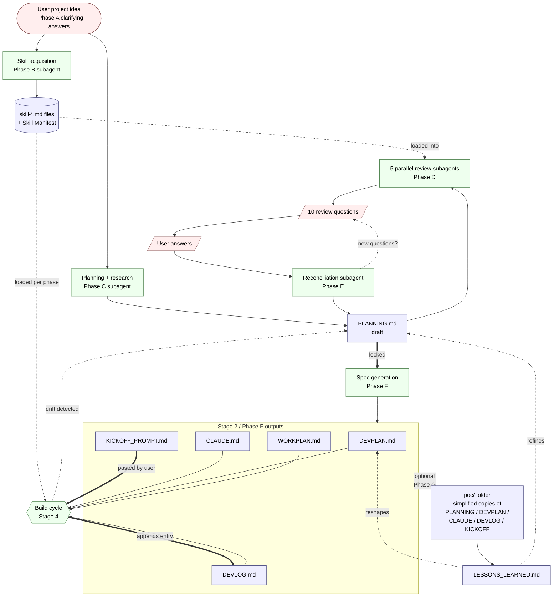
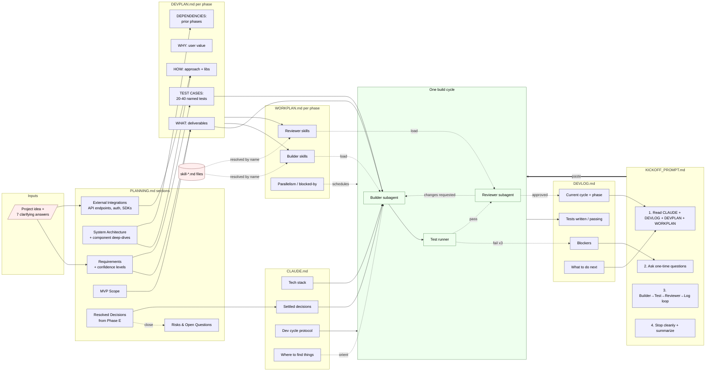

# Architecture — Artifact Data Flow

This document visualizes how documents flow through the framework: who produces them, who consumes them, and how state is carried forward between sessions. For the methodology behind the flow, see [WORKFLOW.md](WORKFLOW.md). For the prompt that drives it, see [BOOTSTRAP_PROMPT.md](BOOTSTRAP_PROMPT.md).

The framework's "data" is Markdown files. Every arrow below is a file being written, read, or updated.

---

## 1. High-Level View

The pipeline turns a one-line idea into a self-resuming build loop. PLANNING.md is the gating artifact — nothing downstream is generated until it's locked.

**Reading the diagram:**

- **Solid arrows** = a file is written or a step always happens.
- **Dotted arrows** = conditional: optional stage, loop, or feedback edge.
- **Double-line arrows (`==>`)** = a gate the user explicitly triggers (locking PLANNING, pasting KICKOFF_PROMPT).
- **Feedback edges** are first-class: `LESSONS_LEARNED.md → PLANNING.md`, `Cycle → DEVLOG.md`, and the `drift detected → PLANNING.md` edge are how the framework stays consistent over time. PLANNING.md should always describe the system as it is, not as it was originally imagined.

---

## 2. Detail View — Field-Level Flow Between Artifacts

The high-level view shows *which* files connect. This view shows *what* moves between them. Each label on an edge names the section, list, or piece of state that the downstream artifact consumes.

**What this shows that the high-level view doesn't:**

- **Tests are the load-bearing edge.** `PLANNING.md → Requirements → DEVPLAN.md → Tests → Builder` is the spine of the framework. The named test cases in DEVPLAN.md are the actual specification handed to the builder subagent — code is only ever written to make those named tests pass.
- **WORKPLAN.md is a name-resolver.** Its only job is to map phase IDs to the subset of `skill-*.md` files that should be loaded into the builder/reviewer subagents for that phase. Skill files themselves are downloaded once in Phase B and re-used for the lifetime of the project.
- **CLAUDE.md is read every session; DEVLOG.md is written every session.** The pair forms the framework's persistent memory. Settled decisions go to CLAUDE.md (so they're never re-litigated); per-cycle state goes to DEVLOG.md (so the next session can resume).
- **The fail-x3 → Blockers edge is the only path that escapes the cycle.** Three failed test runs on a phase means the cycle stops, the blocker is logged, and the user is asked to intervene before the next paste of KICKOFF_PROMPT.md.
- **KICKOFF_PROMPT.md never reads from itself.** It is purely a launcher — the build cycle consumes the four other Stage-2 artifacts directly.

---

## Where each artifact is templated

Every artifact in the diagrams above starts from a template in [`templates/`](templates/):

| Artifact | Template |
|---|---|
| PLANNING.md | `templates/PLANNING_TEMPLATE.md` |
| DEVPLAN.md | `templates/DEVPLAN_TEMPLATE.md` |
| WORKPLAN.md | `templates/WORKPLAN_TEMPLATE.md` |
| CLAUDE.md | `templates/CLAUDE_TEMPLATE.md` |
| DEVLOG.md | `templates/DEVLOG_TEMPLATE.md` |
| KICKOFF_PROMPT.md | `templates/KICKOFF_PROMPT_TEMPLATE.md` |
| poc/* | `templates/POC_SETUP_TEMPLATE.md` |
| LESSONS_LEARNED.md | `templates/LESSONS_LEARNED_TEMPLATE.md` |

Templates use `{{PLACEHOLDER}}` syntax; the bootstrap pipeline fills them in.
